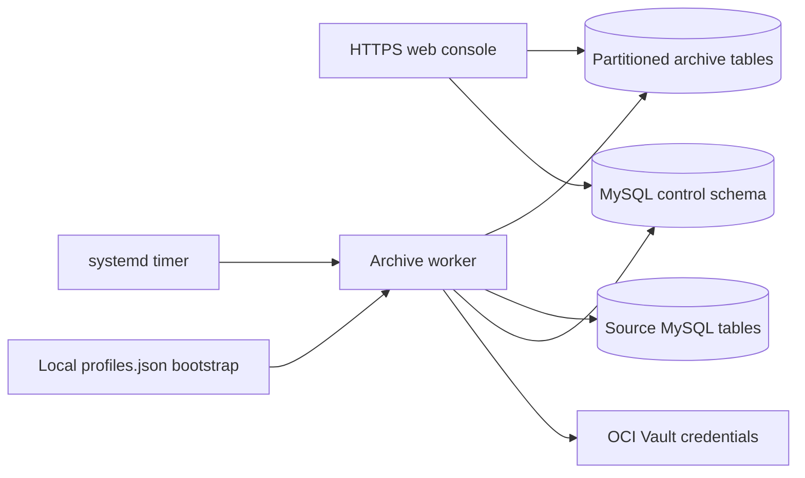

# MySQL Log Archiver: technical operations

This document describes the implemented worker, storage model and operational controls. It covers configuration-only restore and the distinctions between the control database, source databases and archive databases. Related documents: [control database](archive-control-database.md), [incremental retrieval](incremental-source-retrieval.md), and [architecture](log-archiving-detailed-architecture.md).

## Components and execution flow



The installed paths and service names remain `error-log-archiver` for compatibility; the application banner is **MySQL Log Archiver**.

| Component | Role |
|---|---|
| `error-log-archiver-web.service` | HTTPS console; one Gunicorn process and eight request threads |
| `error-log-archiver.timer` | Starts the worker about two minutes after boot and evaluates again at one-minute intervals |
| `error-log-archiver.service` | One-shot execution of `archive_worker.py`; exits after evaluation or processing |
| Control profile | Locates the MySQL control server/schema and its unattended credential Secret OCID |
| Source connections | Locate tables/views from which records are read |
| Archive connections | Locate destination schemas/tables for ingestion and partition maintenance |

The control worker is the scheduled archiving worker, rather than a separate configuration synchronization service. Its sequence is:

1. Load the active local control profile. Without a configured control schema, exit without archiving.
2. Retrieve the control credential from OCI Vault and read settings/state from MySQL. A disabled job records `Disabled` and exits.
3. Acquire the shared nonblocking execution lock. If another execution owns it, skip this attempt.
4. Check the saved scheduled `last_success` against the configured interval, such as `5min` or `1hour`. If not due, exit.
5. Resolve credentials for enabled mappings, prepare destination schemas/partitions, and stream qualifying source records into the archive.
6. Prune expired partitions after each mapping's ingestion succeeds. Complete all enabled mapping tasks; check execution ownership/cancellation.
7. Update the scheduled success time and publish the successful result and source checkpoints in the control database while holding the lock.
8. Release the lock connection. Exceptions produce a failed result and a nonzero worker exit; failure recording itself requires an available control database.

Changing the saved interval applies on the next evaluation without restarting the timer. This is not a backlog of one execution per missed interval. A manual **Run archive now** uses the same lock and extraction logic, bypassing the scheduled due-time check and the global scheduled-job enabled flag; individual mapping enable flags still apply.

Mappings are authoritative when present: disabled mappings are skipped, and a configuration with all mappings disabled copies no rows. Without mappings, the legacy default source/archive configuration remains supported. `worker_threads` caps parallel mapping tasks. Connection reuse serializes operations sharing one connection identity, so increasing threads does not guarantee parallel execution against the same database account.

## Control database and durable state

The control database is an operational store, not merely a user/password connection check. The named schema defaults to `archive_control` and can be chosen during **Control DB** setup.

| Storage | Information |
|---|---|
| `control_settings` | Singleton policy JSON: enabled flag, schedule, retention, batch size, worker threads, archive setup values |
| `control_entities` | Ordered JSON records for source/archive connections, source/archive tables, mappings and custom sources |
| `control_state`, key `job` | Latest result, inserted counts, per-source timestamp checkpoints and execution history (up to 288 events) |
| `control_state`, key `worker` | Last successful scheduled execution time |
| `control_state`, key `execution` | Execution ID, owning MySQL connection ID and cancellation request |
| Local `profiles.json` | Non-secret control bootstrap: server/socket, schema, profile, worker username, Secret OCID and active selection |
| Web process memory | Expiring interactive sessions, login credentials and cached connections/credentials |
| Archive databases | Actual archived log records and partitions |

Configuration and state are stored as JSON **inside MySQL tables**. Operational settings are not mirrored to an active local settings JSON file. The local bootstrap is necessary to locate the control database before it can be queried. There is no automatic local fallback when control MySQL is unavailable.

Ordinary authenticated navigation reads control MySQL with the login session's credentials. It does not fetch Vault credentials merely to open setup/configuration/summary screens. Archive reports and Log Explore connect to their selected archive destination when data is requested.

A second Compute can use the same control server/schema by installing the exported worker profile and granting that Compute access to the referenced secrets. It then shares settings, scheduling state, checkpoints and locking. Login sessions remain local to each web process. Separate replicated MySQL control servers do not share the named execution lock.

## Archive table structure

Each application-created destination is an InnoDB table with this envelope:

```sql
CREATE TABLE archive_schema.archive_table (
    event_time DATETIME(6) NOT NULL,
    log_type VARCHAR(255) NOT NULL,
    payload JSON NOT NULL,
    archived_at TIMESTAMP(6) NOT NULL DEFAULT CURRENT_TIMESTAMP(6),
    source_fingerprint BINARY(32) NOT NULL,
    PRIMARY KEY (event_time, source_fingerprint),
    KEY ix_archived_at (archived_at)
) ENGINE=InnoDB
PARTITION BY RANGE COLUMNS(event_time) (
    PARTITION p_bootstrap VALUES LESS THAN ('2000-01-01')
);
```

`event_time` contains the source timestamp, interpreted consistently in UTC by the operating configuration. `payload` contains the remaining source columns; the timestamp is moved into `event_time`. `archived_at` is the insertion timestamp. Standard labels are `error_log`, `general_log` and `slow_log`; custom labels use the configured source name. The binary SHA-256 fingerprint identifies replayed source records.

## Partition creation and retention

The partition key is **source event time**, not insertion time. Monthly names follow `pYYYYMM`; each upper boundary is the first day of the following month, exclusive. For a continuous sequence of partitions:

| Partition | Normal range | Upper boundary |
|---|---|---|
| `p202609` | September 2026 | `2026-10-01` |
| `p202610` | October 2026 | `2026-11-01` |
| `p202611` | November 2026 | `2026-12-01` |

`ensure_schema()` creates missing schema/table definitions and invokes `ensure_future_partitions()` before ingestion. The default preparation window includes the first month at the retention cutoff, every month through the current month, and **two months ahead**. Existing partition names are skipped. Future partitions can also be prepared through the Archive partition controls with a selected horizon.

Example: with current month October 2026 and retention `12`, the floor is `2025-10-01`. Preparation requests monthly partitions October 2025 through December 2026. Retention is aligned to month starts: it includes the current partial month plus the preceding twelve calendar months, rather than an exact rolling 365-day duration.

After ingestion, `prune_expired_partitions()` drops named monthly partitions whose month is earlier than the floor. Dropping a partition permanently removes its rows and definition. `p_bootstrap` is excluded from automatic retention pruning and the UI's monthly truncate/drop actions. There is no `MAXVALUE` catch-all; timestamps beyond the prepared horizon can fail insertion or be ignored by `INSERT IGNORE`.

Maintenance is application-driven, not a MySQL event scheduler. It requires an actual enabled archive run or the explicit preparation action, and archive DDL permissions. A disabled/not-due/busy worker does not maintain partitions. DDL commits independently of ingestion; cancellation does not undo partition changes.

Important structural details:

- RANGE partitions have only upper bounds. The earliest partition after `p_bootstrap` may accept timestamps much older than its name suggests. After dropping an intermediate partition, the next partition covers that gap.
- `ADD PARTITION` appends increasing boundaries. The helper does not reorganize an existing table to insert older/intermediate missing boundaries. Extending retention backward or recreating a manually dropped interior partition can require DBA-managed `REORGANIZE PARTITION`; the current helper may fail for that case.
- Existing tables are not automatically converted from arbitrary schemas or partition layouts.
- The cycle currently counts partition additions in a second preparation call after schema preparation. That counter can show zero even when the earlier preparation created partitions. Use the Partitions view/MySQL metadata to verify actual boundaries.

## Incremental source selection and batching

| Source | Table | Timestamp |
|---|---|---|
| Error log | `performance_schema.error_log` | `LOGGED` |
| General log | `mysql.general_log` | `event_time` |
| Slow log | `mysql.slow_log` | `start_time` |
| Custom | Configured `schema.table` or view | Configured timestamp column |

Each source/mapping has a durable checkpoint. Mapping cursor identities use `custom:<mapping-name>` for backward compatibility; renaming a mapping changes that identity and can trigger replay with new fingerprints. The worker issues one query per source:

```sql
SELECT *
FROM source_schema.source_table
WHERE timestamp_column >= %s
ORDER BY timestamp_column ASC;
```

The parameter is the saved source checkpoint, or the retention floor if none exists. `>=` replays the timestamp boundary so records sharing that timestamp remain eligible. `SELECT *` retrieves all columns of qualifying rows; it does not request every row without filtering. An efficient timestamp range scan still depends on the source's indexes and query plan.

The cursor is unbuffered. `fetchmany(batch_size)` consumes one result stream until exhausted, without SQL `LIMIT`, offset pagination or a repeated timestamp query between batches. Batch size bounds each client fetch group; it does not bound the full transaction or maximum records per run.

Insertion uses `INSERT IGNORE` and a fingerprint computed from:

```text
source cursor identity | source event timestamp | canonical JSON payload
```

The primary key suppresses replay duplicates. A batch with zero inserted rows logs an INFO diagnostic and processing continues. It is not evidence that batch size is too small. `INSERT IGNORE` can also mask some nonduplicate data conditions; zero inserts do not prove that all ignored rows were duplicates.

The archive transaction commits before checkpoints are published. A crash after archive commit but before checkpoint recording causes replay, with duplicate suppression on retry. Different mapping transactions and control-state updates are not one distributed transaction; a failed cycle may have committed some mappings already.

Rows arriving with timestamps **older** than the checkpoint remain outside the query. Boundary replay does not provide an overlap window or change data capture. Source truncation/ring-buffer eviction can also lose records before extraction. Two records with the same cursor identity, timestamp and canonical payload collapse into one archived record.

## Export, import and another Compute

First save policy and entity edits. **Export job settings JSON** reads the saved control database state; downloading does not save unsaved form values or write a local worker settings file.

| Export | Includes | Excludes / use |
|---|---|---|
| `job-settings.json` | Saved policy including `enabled`, source/archive definitions, tables and mappings | No plaintext credentials, control bootstrap, history, checkpoints or archived data; configuration-only restore |
| Worker control profile `profiles.json` | Active control profile, host/socket, schema, worker user and credential Secret OCID | No plaintext password; bootstrap another Compute against the shared control database |

Both exports require an authenticated management profile. Secret OCIDs are references, not secret values, but the files reveal infrastructure details and should be stored with restricted access.

### Restore settings into a fresh control database

1. Create/select the new control connection profile and open **Control DB**.
2. Enter the schema, unattended worker user and credential Secret OCID. Use **Test / validate Secret OCID**, then **Create or connect control schema**. Testing alone does not save/activate a profile or create missing tables.
3. Before creating other configuration, open **Job configuration → Import job settings into a fresh control database**.
4. Select `job-settings.json`, confirm restoration of its saved enabled state, and click **Import job settings JSON**.
5. Review the policy/connections/tables/mappings and export again if you want to compare the restored snapshot.

Import accepts up to 2 MiB of JSON, validates types, identifiers and references, rejects plaintext credential fields, acquires the shared execution lock, checks the target configuration is empty under a row lock, and writes policy/entities in one transaction. It does not retrieve or test source/archive secrets during validation. Those secrets and network endpoints must be usable from the new Compute.

An imported `enabled: true` policy can run on the next timer evaluation. Stop the target timer before importing if you need to review enabled settings first, then start it after review. The target's control connection profile remains unchanged. History/checkpoints and archive rows are not restored. With no checkpoints, the first run starts at the retention floor and deduplicates against existing destination rows.

For another Compute using the **same** control database, install the worker-profile export at `/var/lib/error-log-archiver/profiles.json`, owned by `errorlogarchiver`, mode `0600`, and authorize its instance principal. Do not import job settings into that already populated shared schema. For full recovery, back up the control schema and archive databases separately; JSON settings exports are not database backups. The separate legacy Compute-JSON migration can restore old local history/checkpoints into an empty control schema; see the control-database document.

## Protections and their boundaries

| Protection | Implemented behavior and boundary |
|---|---|
| Credential handling | OCI instance-principal Secret Bundle retrieval; only Secret OCIDs are persisted. Scheduled credentials stay in process memory. Web Vault cache defaults to 300 seconds; connection/settings changes clear credential caches. |
| Interactive authentication | MySQL login; opaque session ID in signed browser cookies; credentials held in expiring server memory. Default TTL is 3,600 seconds. A web restart invalidates these sessions. |
| Browser cookie and form controls | `Secure`, `HttpOnly`, `SameSite=Strict` cookies; CSRF token validation on POST forms; authenticated routes for log browsing; management-profile checks on configuration, imports and partition lifecycle actions. |
| Transport | HTTPS console, with a self-signed certificate created by setup unless replaced. TCP MySQL connections request TLS; the current adapter does not configure CA/hostname identity verification. Unix-socket connections are local. |
| SQL safety | SQL values bound as parameters; identifiers validated; explorer sort roots checked against metadata and JSON paths bound as values; literal search wildcards escaped. |
| Output safety | HTML template escaping; full-cell contents assigned as text; explorer CSV values beginning with spreadsheet formula markers are prefixed. Archived payloads remain sensitive application data. |
| Execution exclusion | Dedicated MySQL `GET_LOCK`, nonblocking, keyed by control schema on the same server. Web/manual/scheduled workers and multiple Computes share it. |
| Cancellation override | Administrator requests cancellation for a specific execution ID. Workers check between batches and before commit/state publication; another writer never bypasses the lock. Blocked database calls must return before cancellation is observed. |
| Crash recovery | Closing the lock connection releases its lock. A lost network session may require MySQL timeout detection; stale execution metadata itself is not a lock. Committed archive records are replay-safe by fingerprint. |
| Transaction handling | Atomic settings imports/saves; state rows locked during updates; uncommitted failed archive transactions roll back. DDL and separate mappings/control updates are not globally atomic. |
| Host isolation | Non-root service account; `NoNewPrivileges`, `PrivateTmp`, `ProtectHome`, `ProtectSystem=strict`; runtime writes restricted to the state directory. Only the HTTPS web unit receives `CAP_NET_BIND_SERVICE`. |
| Read-only exploration | Log Explore issues metadata/SELECT queries and exports. Pages fetch 25/50/100/250 rows plus one next-page probe; charts restrict date ranges and cap at 1,000 buckets. Search/sort can still scan large matching datasets. |

`profile_management` is a local bootstrap-profile authorization flag, not a separate enterprise RBAC system. Protect profile files, account access and database grants. Initialization needs schema/table creation privileges; runtime control operations need SELECT/INSERT/UPDATE/DELETE, sources need SELECT, and archive operations need ingestion and DDL permissions. OCI IAM should scope Secret Bundle reads to the referenced secrets. The execution lock coordinates archive runs and settings imports; standalone partition preparation/truncate/drop actions do not acquire it. Coordinate these maintenance actions with workers. Concurrent administrator settings edits use last-save-wins behavior, without a revision-conflict UI. Neither an application lock nor a settings export provides MySQL backups, database-at-rest encryption, a durable audit trail or source-data completeness guarantees.

## Operational checks and deployment

```bash
systemctl status error-log-archiver-web error-log-archiver.timer error-log-archiver.service
systemctl list-timers error-log-archiver.timer
journalctl -u error-log-archiver.service -n 100 --no-pager
journalctl -u error-log-archiver-web.service -n 100 --no-pager
```

The one-shot worker being inactive after a successful run is normal. Inspect its last exit status and journal when investigating a failed summary. Confirm selected archive partitions, retention, saved enable state, Secret OCIDs, endpoint connectivity and database grants.

For code/dependency/service changes, use the documented rerunnable `setup.sh` update procedure after a fast-forward pull; it stops timer/web and refuses dependency replacement while a worker is active. For documentation-only updates, a fast-forward deployment pull is sufficient; it does not require a worker restart or interrupt an archive transaction.

Verification:

```bash
python -m unittest discover -s tests -v
```

The opt-in control-MySQL suite creates and drops a disposable `archiver_test_*` schema. It covers cross-process state/locks, crash cleanup, cancellation, import protection and real JSON sort/search/time aggregation. It does not mutate the production control configuration. Source extraction tests cover timestamp ties, replay deduplication and write failures; they do not establish every source's query plan or availability guarantee.
